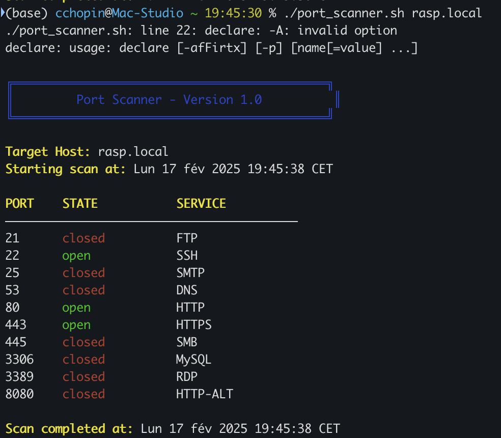

# Port Scanner Bash Script

A simple yet powerful port scanner written in Bash, developed as part of a cybersecurity training. This tool allows you to scan TCP ports on any target host to identify open services.

## Features

- Scan predefined common ports (top 10 most used)
- Scan a specific port
- Color-coded output for better readability
- Service identification
- No external dependencies (uses native Bash features)

## Usage

```bash
# Scan default ports
./port_scanner.sh <host>

# Scan specific port
./port_scanner.sh <host> <port>
```

## Example Output

```
╔════════════════════════════════════════════╗
║ Port Scanner - Version 1.0                 ║
╚════════════════════════════════════════════╝

Target Host: localhost
Starting scan at: Mon Feb 17 10:30:45 EST 2025

PORT    STATE    SERVICE
─────────────────────────────────────────
80      open     HTTP
443     closed   HTTPS
22      open     SSH
```



## Educational Purpose

This script was created as part of a cybersecurity training program to understand:

- Network scanning techniques
- Port states and services
- Bash scripting capabilities
- Network security basics

## Disclaimer

This tool is for educational purposes only. Always ensure you have permission to scan any target hosts.
